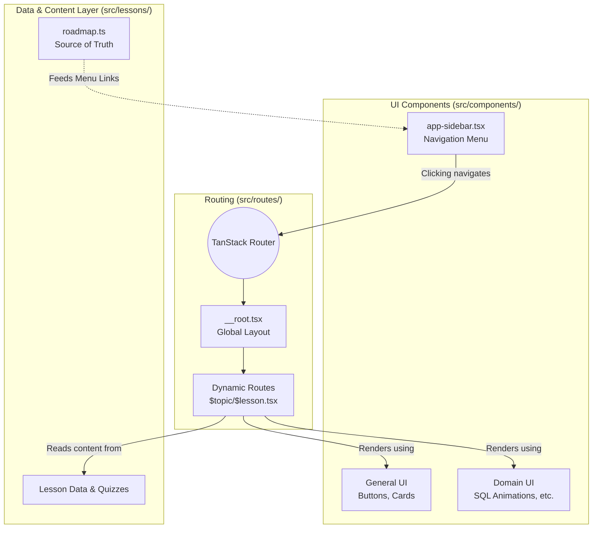

# Codebase Overview & Architecture

Welcome to the codebase! This document outlines how the application is structured and how the different pieces (Routing, UI, Data) work together.

## System Architecture Diagram

## 1. Curriculum & Content Data (`src/lessons/`)
This folder acts as the **data source** for the educational content. It keeps the heavy text and structure separate from the UI components.

- **`roadmap.ts`**: The central source of truth for the course navigation. It exports a `roadmap` object which defines the entire syllabus (Categories → Sections → Patterns → Lessons). This file dictates *what* content exists.
- **Content files**: Contains the specific text, quizzes, and configurations for different lessons (e.g. SQL, Python, DSA).

## 2. UI Components (`src/components/`)
Contains all reusable React components, separated into general UI and domain-specific features.

- **`app-sidebar.tsx`**: The main navigation sidebar. It imports the data from `roadmap.ts` and maps over it to render the interactive, collapsible links.
- **`ui/`**: General reusable components (often powered by a component library like shadcn/ui), such as Buttons, Collapsibles, and Inputs.
- **Domain folders (e.g., `sql/`, `python/`)**: Specialized components for specific interactive lessons, such as custom animations or interactive code blocks.

## 3. Routing (`src/routes/`)
The application uses **TanStack Router** for file-based routing. The folder structure inside `src/routes/` automatically dictates the URLs of the application.

- **`__root.tsx`**: The global layout wrapper that surrounds all pages.
- **`index.tsx`**: The homepage component (`/`).
- **Dynamic Routes**: Files like `$topic/$lesson.tsx` act as catch-all templates that read the URL parameters to render the appropriate lesson content based on the data provided by `src/lessons/`.

## 4. Workflows & State
### How a Lesson Page Works:
1. The user clicks a link in the **App Sidebar** (rendered from `roadmap.ts`).
2. The **Router** matches the URL to a file in `src/routes/` (like `/sql/foundations/database-fundamentals`).
3. The Route component fetches the specific lesson details from the `src/lessons/` data files.
4. The Route component renders the specific **UI Components** (text, animations, playgrounds) to display the lesson on the screen.

---
*Note: Keeping data (`roadmap.ts`) and presentation (`app-sidebar.tsx`) separated allows us to scale the curriculum infinitely without rewriting complex UI logic each time.*
