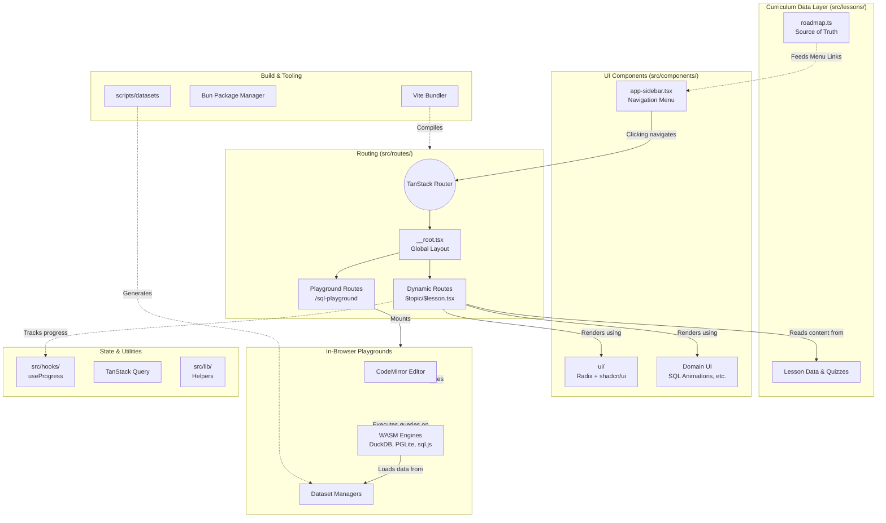

# DataVizCore: Full System Architecture

This document serves as the comprehensive architectural reference for the DataVizCore repository. It covers the technology stack, project structure, core domains, state management, and build processes.

---

## 1. Technology Stack
The project is a modern, client-side heavy web application built with the following technologies:
- **Core Framework**: React 19 + TypeScript
- **Routing**: `@tanstack/react-router` (File-based routing)
- **State Management**: React Hooks + `@tanstack/react-query`
- **Styling**: TailwindCSS v4 + `class-variance-authority` + `clsx` + `tailwind-merge`
- **UI Components**: Radix UI primitives (`@radix-ui/*`) + shadcn/ui
- **Code Editor**: CodeMirror 6 (`@uiw/react-codemirror`)
- **In-Browser Databases (WASM)**: DuckDB-WASM, PGLite, and sql.js
- **Build Tooling**: Vite + Bun
- **Linting & Formatting**: ESLint + Prettier

---

## 2. Directory Structure

```text
/
├── .tanstack/           # TanStack Router generated configuration
├── docs/                # Project documentation and architectural specs
├── public/              # Static assets (favicons, manifest)
├── scripts/             # Node.js scripts (e.g., datasets/build.mjs for processing CSVs)
├── src/                 # Main application source code
│   ├── components/      # React components (UI, Playgrounds, Domain-specific)
│   ├── hooks/           # Custom React hooks (e.g., user progress)
│   ├── images/          # Image assets and logos
│   ├── lessons/         # Curriculum data source (roadmap.ts, text, quizzes)
│   ├── lib/             # Utilities, formatters, and helpers
│   ├── routes/          # TanStack file-based route definitions
│   └── styles.css       # Global stylesheet (Tailwind directives)
├── package.json         # Dependencies and NPM scripts
├── vite.config.ts       # Vite bundler configuration
└── bunfig.toml          # Bun package manager configuration
```

---

## 3. System Architecture Diagram



---

## 4. Core Domains & Workflows

### A. Curriculum & Lesson Rendering
The application strictly separates content (data) from presentation (UI).
- **`src/lessons/roadmap.ts`**: The central configuration file. It defines every course track, section, pattern, and lesson. It dictates the URL paths, sidebar titles, icons, and descriptions.
- **Rendering Workflow**: 
  1. `app-sidebar.tsx` maps over `roadmap.ts` to build the navigation.
  2. When a user clicks a lesson, TanStack router loads a dynamic route (e.g., `src/routes/sql/$lesson.tsx`).
  3. The route fetches the specific text, quiz data, and component references from `src/lessons/` and renders them using `src/components/sql/` components.

### B. Interactive Playgrounds (WASM)
Playgrounds bypass the standard lesson structure to provide full-screen, interactive coding environments entirely in the browser.
- **CodeMirror Integration**: Used heavily for syntax-highlighted SQL and Python editors (`@uiw/react-codemirror`).
- **WASM Databases**: The SQL playground (`src/components/sql-playground`) spins up local WebAssembly databases (DuckDB-WASM, PGLite, or sql.js) so users can execute real SQL queries against datasets without needing a backend server.
- **Dataset Generation**: `scripts/datasets/build.mjs` is run via `npm run datasets` to process CSV files into a format the WASM databases can easily ingest on the client side.

### C. UI Component Architecture (`src/components/`)
Components are strictly categorized to prevent massive, bloated files:
- **`ui/`**: Purely presentational, generic components built on top of Radix UI primitives (buttons, dialogs, dropdowns). They have no business logic.
- **`app-sidebar.tsx`, `Footer.tsx`, `ThemeToggle.tsx`**: Global layout components.
- **Domain Folders (`sql/`, `python/`, `mongodb/`)**: Specialized components containing the heavy logic for specific topics (e.g., custom animations for database joins, or interactive binary tree visualizers).

### D. Routing (`src/routes/`)
Using **TanStack Router**, the filesystem dictates the URL structure.
- `__root.tsx` is the outermost wrapper providing Context Providers, the Sidebar, and the overall application layout.
- The route tree is automatically generated into `src/routeTree.gen.ts`.

## 5. Scripts and Tooling
- **`npm run dev`**: Starts the Vite development server.
- **`npm run build`**: Compiles the application for production deployment.
- **`npm run datasets`**: Executes the Node.js script `scripts/datasets/build.mjs` to prepare static dataset files for the SQL playgrounds.
- **`npm run lint` / `format`**: Ensures code quality using ESLint and Prettier.
