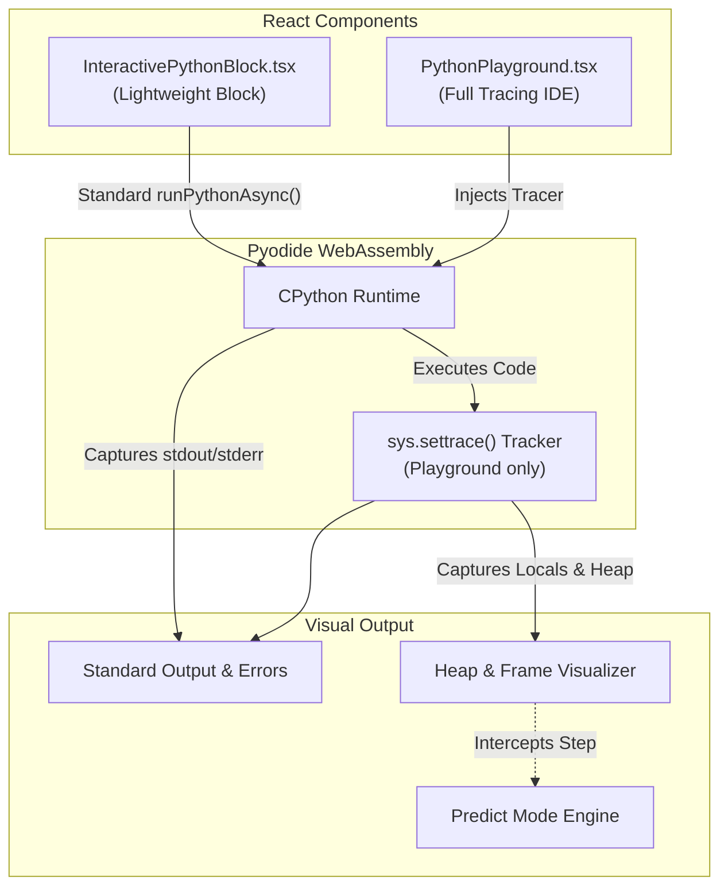

# Python Playgrounds: Interactive Tracing & Execution

This document describes the architecture of the Python execution environments in DataVizCore, which provide in-browser Python execution, visual heap tracing, and interactive in-lesson learning blocks.

> [!NOTE]  
> All Python execution happens entirely in the browser using WebAssembly. No code is sent to a backend server to execute.

## 1. System Architecture Diagram

## 2. In-Browser Execution (Pyodide)

Both environments use **Pyodide** (CPython compiled to WASM). 
To avoid bloating the initial application bundle and page load:
- Pyodide is loaded dynamically on-demand from a CDN via `src/lib/pyodide-loader.ts`.
- The runtime instance is cached on the `window` object as `window.__pyodide`.

## 3. In-Lesson Code Blocks (`InteractivePythonBlock.tsx`)

For guided lessons and quizzes, we use a lightweight CodeMirror block that executes Python directly.
- **Purpose**: Let learners quickly run snippets (e.g. testing string slicing or basic math) directly inside a curriculum page without context-switching.
- **Execution**: Calls the standard `pyodide.runPythonAsync(code)`.
- **Output**: Intercepts `sys.stdout` and `sys.stderr` via `pyodide.setStdout` and streams it directly to a terminal-style DOM node at the bottom of the block.
- **Overhead**: Minimal. It does not trace memory, pause execution, or use `sys.settrace()`.

## 4. The Full Execution Tracer (`python-tracer.ts`)

The full `PythonPlayground.tsx` is meant for deep algorithmic learning. Instead of just evaluating code, it injects a custom Python tracer script before running the learner's code.

It hooks into the Python `sys.settrace()` API and records a complete memory snapshot at every executed line, function call, and return.

A single snapshot includes:
- **`event`**: The trigger type ("line", "call", or "return").
- **`line`**: The current execution line number.
- **`frames`**: The active call stack, containing function names and local variable values.
- **`heap`**: A flattened memory graph of complex objects (lists, dicts, sets). It captures object types, sizes, and references, resolving cyclic references safely via memory IDs.

> [!WARNING]  
> The tracer runs synchronously in the main thread during execution. A `MAX_STEPS` limit (currently 400 steps) is strictly enforced to prevent `while True:` infinite loops from hanging the browser.

## 5. Visual Memory & Diffing

The `PythonPlayground.tsx` component reads the array of snapshots and offers IDE-grade features:
- **Playback Controls**: Step forward, step back, click the gutter to set breakpoints and "Run to breakpoint", or autoplay at variable speeds (0.5x to 4x).
- **Visual Memory Diffing**: A custom diffing engine compares the current snapshot to the previous one to highlight exactly which variables and heap items changed (flashing them amber).
- **Aliasing Detection**: The engine automatically detects when multiple variables point to the same memory address (e.g., `a = []`; `b = a`) and generates a plain-English warning to the learner about reference mutation.

## 6. Predict Mode (Active Learning)

Predict mode transforms passive watching into active reasoning. It forces the learner to guess the outcome of a step *before* it is revealed on the screen.

The UI engine statically analyzes the transition between `Snapshot[n]` and `Snapshot[n+1]` to dynamically generate multiple-choice questions:
- If a function is about to return a primitive, it asks: *"The function(x=5) is about to return. What value comes back?"*
- If a local variable changes, it asks: *"The highlighted line is about to run. What will `count` be after it?"*

The learner must commit to an answer (with generated decoy options) before the playground allows them to advance to the next step.
