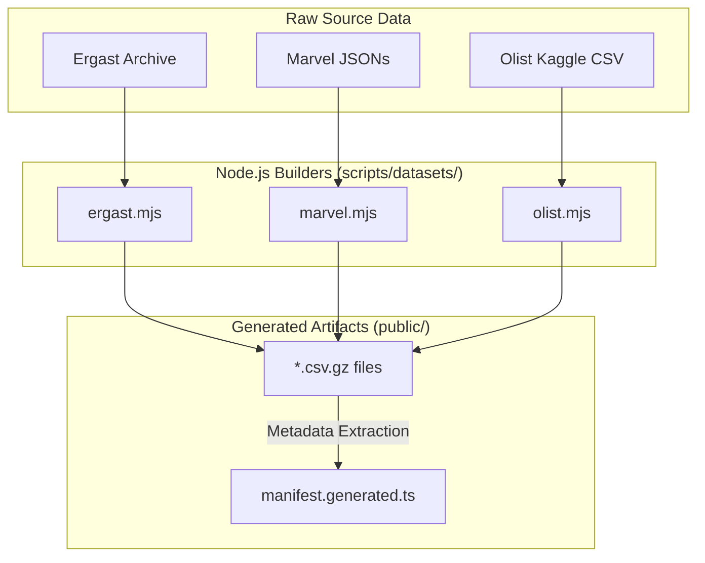

# SQL Playground: Datasets Architecture

This document describes the built-in datasets, the build pipeline that generates them, and how they load in the browser.

## 1. Build Pipeline Diagram

## 2. Included Datasets

| Dataset | Rows | Description |
| --- | --- | --- |
| **Cycle Depot** | 507 | Small synthetic lab, hand-built for tutorials. |
| **Ergast Formula 1** | 701,439 | Racing stats (1950-2024). Standardized snake_case IDs. |
| **Marvel Networks** | 207,727 | JSON arrays flattened into mechanical SQL tables. |
| **Olist** | 1.5M | Real Brazilian e-commerce snapshot (2016-2018). |
| **Cosmetics Shop** | 184,099 | 48-hour slice of Kaggle dataset. |
| **ShopFlow** | 85,070 | Synthetic operations lab generated via deterministic seed. |

> [!NOTE]  
> SQLite is not a dataset or engine here. It is supported purely as an import utility for a learner's own `.sqlite` files.

## 3. Provenance & Data Fidelity

The build pipeline deliberately preserves source fidelity while normalizing formats for the WASM engines:
- **Ergast**: Camel-case converted to snake-case. Empty CSV cells mapped to SQL `NULL`.
- **Marvel**: Preserved exact JSON source; SQL tables are mechanical projections of graph arrays.
- **ShopFlow**: Deterministically generated via Seed `42`.

## 4. Browser Loading Sequence

When a learner interacts with the UI:
1. Learner selects dataset.
2. Browser fetches ONLY that dataset's compressed `.csv.gz`.
3. `loader.ts` creates empty typed tables from `manifest.generated.ts`.
4. The active engine loads the bytes (PGlite uses `COPY`, DuckDB-WASM uses Virtual File System).

> [!IMPORTANT]  
> The data is bundled with the deployed site under `public/datasets/`. It is **not** downloaded live from external sources (like Kaggle) during runtime.
