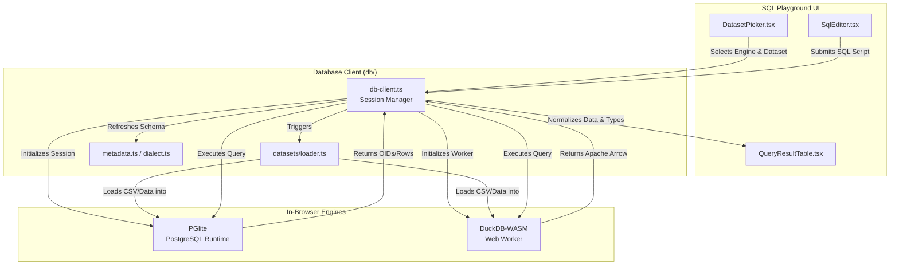

# SQL Playground: Engine Architecture & Extension Guide

This document explains the internal architecture of the SQL Playground, detailing how queries execute in the browser using WASM engines. It also serves as the technical specification for adding future SQL or NoSQL engines.

> [!NOTE]  
> For how datasets are built and loaded, see [SQL Playground datasets](./sql-playground-datasets.md). For requirements on future datasets, see [future dataset guide](./sql-playground-future-datasets.md).

---

## System Architecture Diagram



---

## 1. Current Engine Support

The SQL Playground currently supports two local, browser-based engines. It does **not** send queries or built-in data to an application server.

| Capability | PostgreSQL | DuckDB |
| --- | --- | --- |
| **Browser implementation** | PGlite (WASM) | DuckDB-WASM (Web Worker) |
| **Built-in CSV datasets** | Yes | Yes |
| **CSV uploads** | Yes | Yes |
| **Query plan view** | `EXPLAIN (FORMAT JSON)` | `EXPLAIN (FORMAT json)` (text fallback) |
| **Schema inspection** | PG catalog & `information_schema` | `information_schema` & `duckdb_constraints()` |
| **Execution location** | Learner's browser | Learner's browser |

> [!WARNING]  
> `public/sql/sql-wasm.js` (SQLite) is **not** currently a selectable execution engine. It runs in `sqlite.worker.ts` solely to inspect learner-uploaded SQLite files and export them as CSVs.

---

## 2. Responsibilities by Module

The logic is split to keep the React UI entirely decoupled from the WASM execution environments.

| Module | Responsibility |
| --- | --- |
| `db/db-client.ts` | Owns `engine:dataset` sessions. Manages lifecycle, query execution, result normalization, reset, and CSV upload. Keeps up to 3 sessions warm to control browser memory. |
| `db/datasets/loader.ts` | Creates tables from manifests and bulk-loads generated or CSV data into PGlite/DuckDB. |
| `db/datasets/index.ts` | Declares which dataset supports which engine. |
| `db/metadata.ts` | Reads table, column, primary-key, and foreign-key metadata from catalogs. |
| `db/dialect.ts` | Flags known PG/DuckDB syntax differences before execution. |
| `db/pipeline.ts` | Explains SQL logical order and issues measurement queries. |

---

## 3. Low-Level Execution Details

### PostgreSQL / PGlite
1. **Boot**: Constructs `new PGlite()` and awaits readiness.
2. **Load**: The loader creates typed tables, bulk-loads CSV payloads using `COPY ... FROM '/dev/blob'`, builds keys, and runs `ANALYZE`.
3. **Execution**: `pg.query()` produces rows and PG type OIDs.
4. **Normalization**: The client maps OIDs (`int4`, `text`, `timestamptz`) to readable UI columns, and converts browser-hostile values (BigInt, byte arrays, dates) into render-safe React results.

### DuckDB-WASM
1. **Boot**: Runs in a dedicated Web Worker to prevent UI blocking. Loads the WASM bundle, opens a long-lived connection.
2. **Load**: For each CSV, the loader registers source bytes in DuckDB's virtual filesystem, reads it with manifest-declared types, inserts it into a physical table, and drops the VFS file.
3. **Execution**: Results return as **Apache Arrow** buffers.
4. **Normalization**: The client normalizes Arrow decimals, dates, large integers, arrays, and structs before UI rendering.

### Multi-statement Scripts & Reset
The client intelligently splits semicolon-separated scripts while respecting strings, comments, quoted identifiers, and dollar-quoted PostgreSQL text. It runs statements sequentially and renders the final useful result set. 

Resetting a session drops user schemas/tables and reloads the dataset from the bundled source—it never contacts the original data provider.

---

## 4. Extension Guide: Adding a New Engine

### Execution Models
Before writing UI code, choose the execution model:

| Model | Best for | Pros | Cons |
| --- | --- | --- | --- |
| **Browser-local WASM** | Engines with stable WASM builds (e.g., SQLite) | Total privacy, offline capable, zero server costs. | Huge download size, memory bloat, tricky worker integration. |
| **Remote Sandbox** | Native server products (MySQL, SQL Server) | Highest fidelity to real-world servers. | Requires auth, isolated DBs, backend infra, abuse limits, privacy policies. |

> [!CAUTION]  
> Use a **Remote Sandbox** only with explicit product approval. It completely changes the trust model from "local execution" to "application-managed database."

### Architecture for New Local Engines
To add a new engine (like SQLite), do not scatter `if (engine === 'sqlite')` checks across the codebase. Instead, generalize `db-client.ts` to use a data-driven adapter pattern:

```ts
type EngineAdapter = {
  id: Engine;
  label: string;
  editorLanguage: string;
  boot(dataset: DatasetId, hooks: EngineHooks): Promise<Handle>;
  fetchSchema(dataset: DatasetId): Promise<SchemaSnapshot>;
  explain?(dataset: DatasetId, sql: string, analyze: boolean): Promise<PlanResult>;
  capabilities: {
    csvUpload: boolean;
    queryPlan: boolean;
    pipeline: boolean;
  };
};
```

### Steps to Integrate
1. **Validate Runtime**: Confirm WASM size, memory behavior, and CSV load capability.
2. **Build Adapter**: Implement the `EngineAdapter` interface above.
3. **Extend Registry**: Add the engine to a central registry so the UI (pickers, code formatters) updates automatically.
4. **Implement Metadata**: Add catalog queries to satisfy the `SchemaSnapshot` type (tables, columns, PKs, FKs).
5. **Handle Dialects**: Add syntax warnings to `db/dialect.ts` (e.g., warning about SQLite's lack of window functions in older versions).

---

## 5. Adding NoSQL Engines
NoSQL is **not** a SQL dialect switch. Document, Graph, or KV databases require their own language modes, loaders, and learning goals.

- **Do not** run NoSQL queries through the SQL statement splitter or formatter.
- **Do** create a separate `QueryLanguageAdapter` or an entirely new Playground mode.
- Start with a pre-bundled, local-only WASM snapshot (e.g., local MongoDB WASM or PouchDB).

---

## 6. Required Release Checklist

Before enabling a new engine in the UI, verify all applicable cases:
- [ ] First boot works and reports useful progress/errors.
- [ ] Built-in CSV datasets load with correct types, nulls, and row counts.
- [ ] Results safely render dates, decimals, large integers, and structured values.
- [ ] Single statements and multi-statement scripts execute perfectly.
- [ ] Schema Explorer populates correctly.
- [ ] Reset restores the dataset without errors.
- [ ] Session memory is bounded; eviction (max 3 warm sessions) works cleanly.
