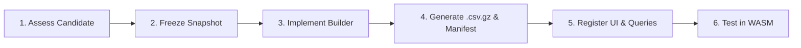

# SQL Playground: Future Dataset Guide

A repeatable delivery contract for adding, reviewing, or removing a built-in SQL Playground dataset.

> [!IMPORTANT]  
> A built-in dataset is a curated set of relational tables loaded entirely in the learner's browser. It is **not** a live connection to a publisher.

## 1. Dataset Lifecycle Diagram



## 2. Selection Criteria

Approve a candidate dataset only when it satisfies these requirements:

| Area | Requirement |
| --- | --- |
| **Teaching Value** | Supports a progression from filtering to joins, CTEs, and window functions. |
| **Relational Design** | At least two useful tables with documented join paths. |
| **Privacy** | Zero personal or secret records. Fully anonymized by publisher. |
| **Browser Fit** | Compressed payload and in-memory load fits in typical laptops. |
| **Portability** | Loads predictably in BOTH PGlite and DuckDB. |

## 3. Build Contract

Every static CSV dataset must use a Node.js builder that returns a manifest matching this schema:

```ts
{
  id: "example",
  tables: [
    {
      schema: "public",
      name: "events",
      file: "events.csv.gz",
      rows: 12345,
      columns: [{ name: "id", type: "INTEGER", notNull: true }]
    }
  ]
}
```

> [!CAUTION]  
> Never hand-edit `manifest.generated.ts`. The `scripts/datasets/build.mjs` script must generate this file automatically to guarantee reproducibility.

## 4. Schema & Data Rules

- Use lower `snake_case` table and column names.
- Choose strictly portable types (`INTEGER`, `DOUBLE PRECISION`, `VARCHAR`, `TIMESTAMP`).
- Declare `notNull` only where the source guarantees it.
- Use a safe empty-string convention for CSV nulls: loaders treat `nullstr = ''` as SQL `NULL`.
- Do not silently repair, deduplicate, or discard records without explicitly documenting the transformation.
