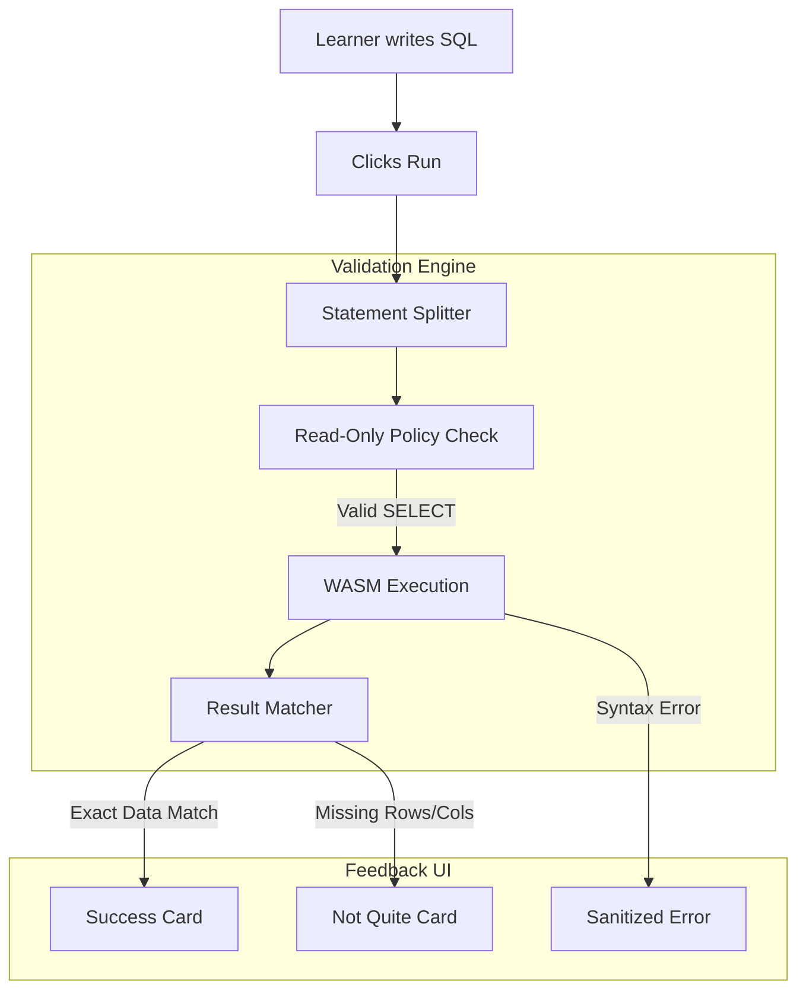

# SQL Playground: Query Challenges

This document defines the practice mode that prompts learners to write SQL, validates it against WASM datasets, and provides rich feedback without requiring one exact query string.

> [!NOTE]  
> Challenges are entirely local. They do not depend on accounts, backends, or LLMs.

## 1. Challenge Validation Flow



## 2. Challenge Data Model

Challenge content is stored strictly as TypeScript definitions in `src/components/sql-playground/challenges/`, never as ad-hoc JSX checks.

```ts
type ResultValidator = {
  kind: "result-set";
  expectedSql: Record<ChallengeEngine, string>;
  requiredColumns: string[];
  rowOrder: "exact" | "any";
}
```

> [!IMPORTANT]  
> **Matching Rules:** The validator checks the *output result set*, not the exact SQL string. A learner using `NOT EXISTS` instead of `LEFT JOIN ... IS NULL` will successfully pass the challenge.

## 3. Submission & Preconditions

When a learner submits a challenge:
1. Confirm the challenge is compatible with the active dataset/engine.
2. Verify it is a single, read-only `SELECT` or `WITH ... SELECT` statement. 
3. Execute the query via the normal WASM client.
4. Validate the resulting fields and rows against the oracle `expectedSql`.

> [!CAUTION]  
> **Read-only Policy**: Reject all `INSERT`, `UPDATE`, `DROP`, `INSTALL`, and DML/DDL commands.

## 4. Feedback States

- **Success**: Green card with a business outcome summary (e.g. "You found all 14 customers").
- **Valid SQL, Incorrect Answer**: Amber card indicating missing columns, wrong sort order, or duplicate rows (e.g. "Return exactly: id, name, country").
- **Query Error**: Sanitized error message underlining the bad token.

> [!WARNING]  
> **Never** expose raw database exception stack traces to the UI. Map them to friendly categories (e.g. "Table does not exist" or "Ambiguous column") to prevent confusing beginners with implementation jargon.
