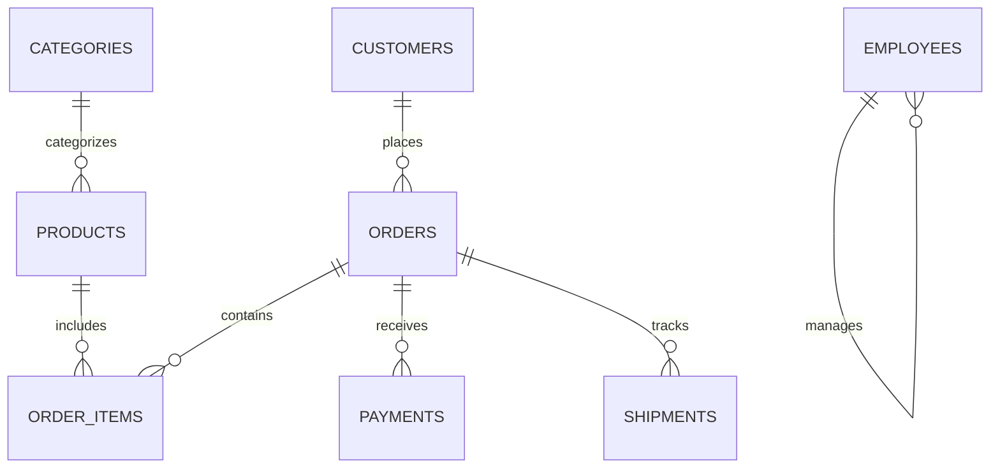

# ShopFlow SQL Lab

ShopFlow is a synthetic, deterministic online-store database designed specifically for teaching complex database operations (constraints, indexes, views, CTEs).

> [!NOTE]  
> Unlike Olist or Ergast, this is not a real-world analysis dataset. It is generated locally using fixed Seed `42` to ensure learners always see the exact same edge cases.

## 1. Relational Architecture Diagram



## 2. Engine Behavior & Capabilities

The browser loader creates empty typed tables and immediately enforces strict relational rules upon boot:

- **Constraints**: Primary keys, Foreign keys, Unique constraints (e.g., Emails), and Check constraints (e.g., non-negative prices).
- **Views**: Creates `customer_order_summary` and `low_stock_products` on initialization.
- **Indexes**: Bootstraps `idx_orders_customer` and `idx_order_items_product`.

Both PGlite and DuckDB-WASM support the shared lab exercises, allowing learners to test features like `EXPLAIN ANALYZE`, recursive CTEs, and `BEGIN/ROLLBACK` transactions locally.

## 3. Rebuild Process

Because it requires no external CSV payloads to build, the lab is instantly reproducible locally:

```bash
node --input-type=module -e "import('./scripts/datasets/sql-lab.mjs').then(({ buildSqlLab }) => buildSqlLab())"
```

## 4. Validation Expectations

The generator uses fixed identifiers, guaranteeing that every declared foreign key resolves perfectly. It produces a strict state machine for datasets:
- Pending shipments have no timestamps.
- Shipped shipments have only `shipped_at`.
- Delivered shipments guarantee `delivered_at >= shipped_at`. 

Runtime loading ensures these constraints are strictly enforced in both WASM engines.
